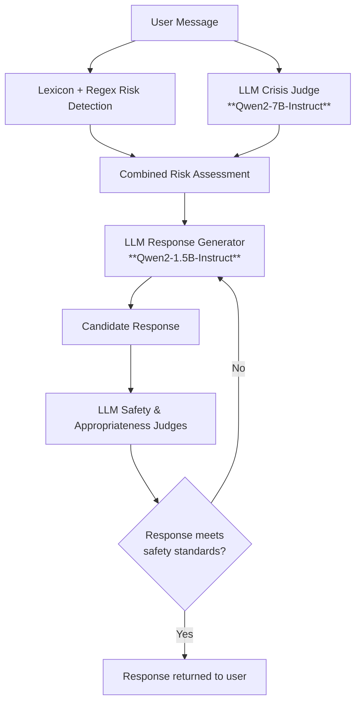

# Crisis Companion: A mental health support chatbot
Prototype mental health support chatbot using hybrid NLP + LLM architecture to detect self-harm risk and generate safe responses. Built to explore responsible use of generative AI in healthcare applications.

This project was developed in partnership with [Ross Jacobucci](https://centerhealthyminds.org/about/people/ross-jacobucci) from the UW Center for Healthy Minds, with the goal of eventually integrating into a clinical app that can support low-moderate risk patient interactions and data collection for research purposes. The code in this repo was developed by Khine Thant Su and Alexandra Wong during the [2025 UW-Madison Machine Learning Marathon](https://ml-marathon.wisc.edu/challenges/crisis-companion/#description-goal), and provides the base logic for the clinical app to be developed.  

# Project Goals
This project explores several questions relevant to AI in mental health support systems:
- How can LLMs be safely integrated into mental health workflows?
- What hybrid architectures work best when balancing safety, performance, and latency?
- How can risk signals (e.g., self-harm indicators) be detected reliably?
- What types of guardrails and response protocols reduce hallucinations and unsafe outputs?

# Development Timeline
| Version     | Key Improvements                                          |
| ----------- | ----------------------------------------------------------|
| V1          | Basic LLM response generation                             |
| V2          | Added risk classifier + response routing                  |
| V3          | Introduced lexicon + LLM judges for risk and safety eval  |
| V4 (current)| Parallelized judge evaluation and reduced latency by ~65% |

# System Architecture
The chatbot uses a hybrid architecture that combines lexicon-based detection, LLM-based risk assessment, and LLM-generated responses with safety evaluation. 

## Base Models
- <b>Qwen/Qwen2-1.5B-Instruct</b> used to generate supportive, non-clinical responses to user messages. 
- <b>Qwen/Qwen2-7B-Instruct</b> used for LLM judges that evaluate crisis risk and assesses candidate responses for safety and appropriateness.

## Risk Evaluation Pipeline
User risk is assessed through a hybrid approach combining rule-based detection and LLM reasoning.
### 1. Lexicon-based Risk Detection
A rule-based system identifies potentially concerning language.
Methods used:
- Curated lexicon of high-risk words and phrases
- Regex matching for flexible pattern detection
This layer provides a <b>fast, interpretable signal</b> for potential self-harm indicators.
### 2. LLM-based Risk Assessment
An LLM judge evaluates the full user message and assigns a risk severity score.
Risk levels include "Low", "Moderate", "High", "Imminent", "Unknown".
This step allows the system to capture contextual signals that may not be detectable through keyword matching alone.

## Response Generation Pipeline
Once risk has been assessed, the chatbot generates and evaluates responses using a multi-step pipeline.
### Step 1: Risk-informed Response Generation
The combined risk signal from lexicon detection and LLM crisis judge is passed to the LLM response generator, which drafts a supportive reply.

Key design choices:
- Responses are supportive and non-clinical.
- High-risk classifications trigger mental health hotline resources.
- Conversations are not automatically terminated for high or imminent risk categories in the current prototype.

### Step 2: Safety and Appropriateness Evaluation
Generated responses are evaluated by LLM judges using prompt-engineered rubrics that assess <b>safety, appropriateness, and alignment with the user message</b>.

### Step 3: Iterative Response Selection
The system generates candidate responses and evaluates them until one satisfies the required safety and appropriateness criteria.

# Performance Optimizations
Between Version 3 and Version 4 (the current version), the system achieved approximately <b>65% latency reduction</b> through several optimizations.
- <b>Pipeline bottleneck identification</b>: We introduced wrapper functions to trace execution time and identify slow components in the pipeline.
- <b>Token length reduction</b>: We shortened prompt and context length to reduce autoregressive generation time for the response model.
- <b>Parallelized judge evaluation</b>: We restructured safety and appropriateness judges to run in parallel instead of sequentially.

# Limitations and Future Improvements
- <b>Clinical validation of risk categories</b> 
The current mapping of risk levels (Low, Moderate, High, Imminent) should be reviewed by mental health professionals to ensure clinical accuracy.
- <b>Response quality decomposition</b> 
Future work could evaluate responses across multiple dimensions such as empathy, actionability, and alignment with user intent. Breaking evaluation into smaller components may allow simpler models to score each dimension more reliably.
